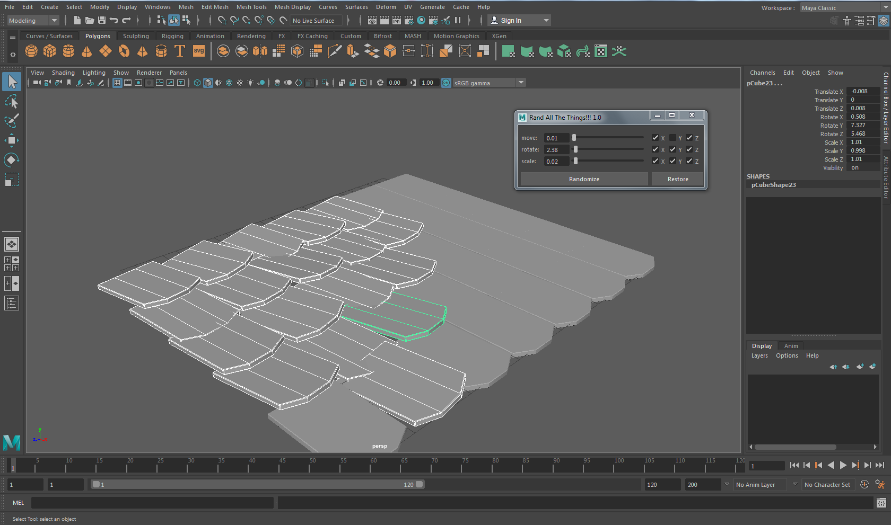

# Randomizer for Maya

Small script designed to give a more organic feel to larger sets (stones, bricks, bushes)
It will move/ scale/ rotate only polygonal objects in a selection and skip over others (ie. ligts, cameras...) and it has a nifty restore button for easy experimentation.

